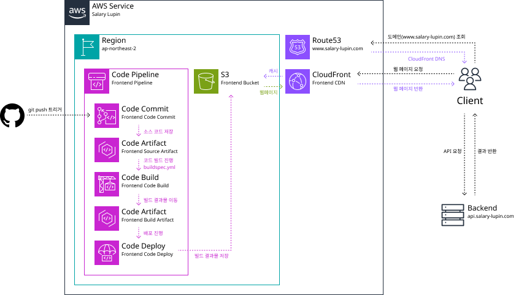

**Salary Lupin은 ‘일하지 않기 위해 일하는’ 사람들을 위한 플랫폼입니다.**

[🔗 웹 사이트 바로가기](https://www.salary-lupin.com)

<br>

⚙️ 프로젝트 개요
본 레포지토리는 Salary Lupin 웹 애플리케이션의 프론트엔드를 담당합니다. \
[백엔드](https://github.com/geist9110/salary-lupin-be)
와 [인프라](https://github.com/geist9110/salary-lupin-be)는 별도의 저장소에서 관리됩니다.
프론트엔드는 인프라 위의 S3와 CloudFront 위에서 동작하며, 백엔드와 HTTP 통신을 통해 데이터를 주고 받습니다.

<details>
<summary>디렉토리 설명</summary>

| 디렉토리/파일           | 	설명                                      |
|-------------------|------------------------------------------|
| `public/`         | 정적 에셋 (파비콘, PWA 아이콘, site.webmanifest)   |
| `src/`            | 소스 코드 디렉토리                               |
| `src/assets/`     | 이미지, SVG 등 정적 에셋                         |
| `src/components/` | 재사용 가능한 UI 컴포넌트 (Card, Footer, Header 등) |
| `src/layout/`     | 페이지 레이아웃 컴포넌트 (DefaultLayout)            |
| `src/pages/`      | 각 페이지별 컴포넌트 (Home, MagicBook 등)          |
| `src/styles/`     | 전역 스타일 (global.css) 및 CSS 변수 정의          |
| `src/types/`      | TypeScript 타입 정의                         |
| `src/utils/`      | 유틸리티 함수                                  |

</details>

<br>

## ⭐️ 주요 기능

### 메인 페이지 (Home)

> 서비스 소개와 함께 다양한 "일하는 척" 콘텐츠 카드 목록을 표시합니다.

### 마법의 고민 해결 책 (Magic Book)

> 사용자의 고민에 대한 무작위 답변을 제공하는 인터랙티브한 책 형태의 UI입니다.

<br>

## 🛠️ 기술 스택

| 분류            | 	기술 스택                         |
|---------------|--------------------------------|
| **UI 프레임워크**	 | React 19.0.0                   |
| **언어**	       | TypeScript ~5.7.2              |
| **빌드 도구**     | 	Vite 6.2.6                    |
| **라우팅**	      | React Router DOM 7.5.0         |
| **CSS**	      | CSS Modules, modern-css-reset  |
| **린팅/포맷팅**    | 	ESLint 9.21.0, Prettier 3.5.3 |
| **패키지 매니저**   | 	npm                           |
| **Node.js**   | \>=20                          |

<br>

## 🧱 웹 사이트 인프라



<br>

## 📦 환경 변수

애플리케이션 빌드 및 실행 시 다음 환경 변수가 사용될 수 있습니다.

| 변수명                | 	설명                | 필수 |
|--------------------|--------------------|----|
| VITE_API_BASE_URL	 | 백엔드 API 서버의 기본 URL | ✅  |

## ⚙️ 프로젝트 빌드 및 실행

### 로컬 개발

Vite 개발 서버를 실행하여 로컬 환경에서 애플리케이션을 개발합니다.

```bash
npm run dev
```

### 프로젝트 빌드

TypeScript 타입 체크 후 Vite를 통해 프로덕션 빌드를 수행합니다. 결과물은 `dist` 디렉토리에 생성됩니다.

```bash
npm run build
```

### 코드 품질 확인

ESLint를 사용하여 코드 린팅 및 포맷팅을 수행합니다.

```bash
npm run lint
npm run format
```

<br>

## 🚀 배포

프론트엔드 배포는 **AWS CodeBuild**를 통해 자동화됩니다.

### AWS CodeBuild

`buildspec.yaml`을 통해 `Node.js 20` 환경에서 `npm ci`로 의존성을 설치하고 `npm run build`로 프로젝트를 빌드합니다. \
`VITE_API_BASE_URL` 환경 변수는 빌드 시점에 주입됩니다. \
최종 빌드 결과물인 `dist` 디렉토리의 모든 파일이 아티팩트로 처리됩니다.